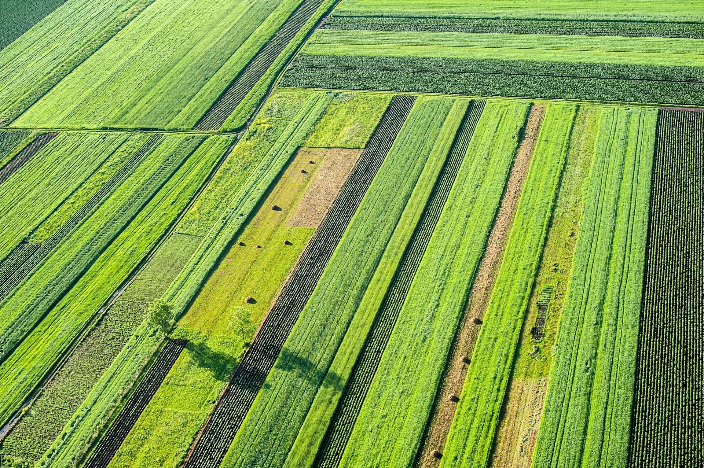
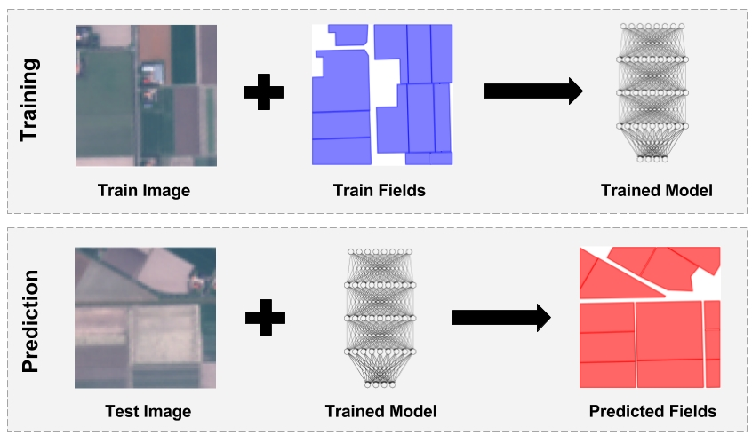
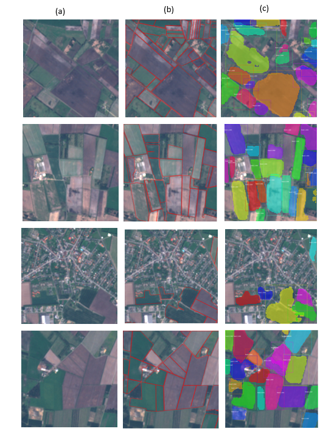

# ForAfric-Agricultural-Fields-Delineation
Instance Aware segmentation  of Agricultural Fields Using Mask R-CNN (Computer vision project)

  

## Abstract
This article aims to delimit agricultural field parcels from satellite images through deep learning for instance segmentation.
Manual delineation is precise but time-consuming, and several automated approaches using traditional image segmentation techniques are struggling to capture the variety of possible appearances in the field.
Deep learning has proven to be effective in the various computer vision tasks, and could be a good candidate for accurate, efficient and generalizable vision of agricultural fields. 
Here, we use the best neural network model for instance segmentation to date: the Mask R-CNN that is formed on Sentinel-2 images corresponding to agricultural field polygons in Denmark. 
Unlike many other approaches, the model works on raw RGB images without pre- and post-processing. 
The results are generalized across different field sizes, shapes and other properties, but show characteristic problems in some cases, especially when we apply it to portions of images from another geographical area (the Zaer region in our case). 
Overall, the results appear promising and would therefore prove the validity of the deep learning approach. 
In addition, the methodology offers many opportunities for improvement.

  

## Results

  
